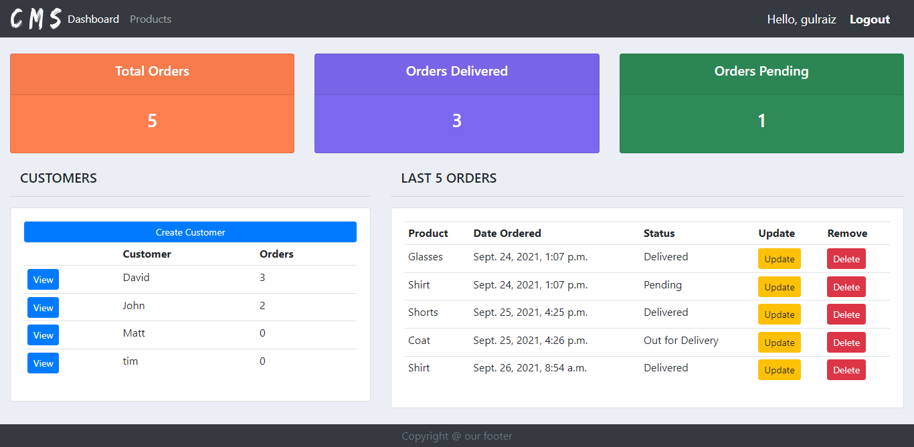

<div align="center">
<h1>MuseCRM</h1>



</div>

~~## Functionalities
- [x] Регистрация пользователей~~~~
- [x] Вход для пользователей
- [x] База данных CRUD операции
- [x] Фото профиля
- [x] Ресет пароля через email
- [x] Поисковая строка~~

## Installation steps

Clone the Repo and install the requirements

```
git clone https://github.com/gulraiznoorbari/Customer-Management-System-Django.git
cd Customer-Management-System-Django
pip install -r requirements.txt
python manage.py makemigrations
python manage.py migrate
python manage.py runserver
```


